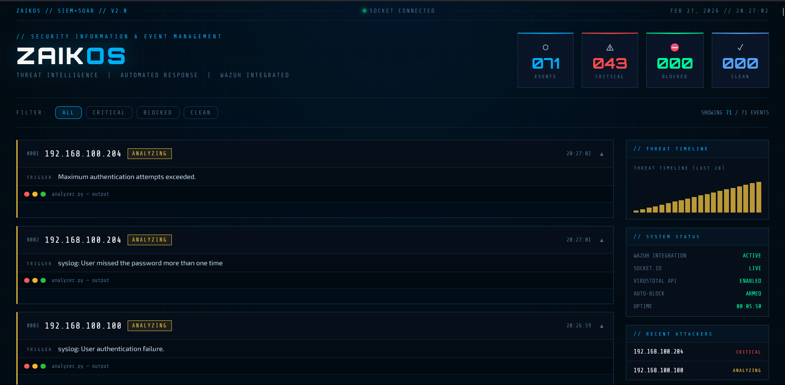
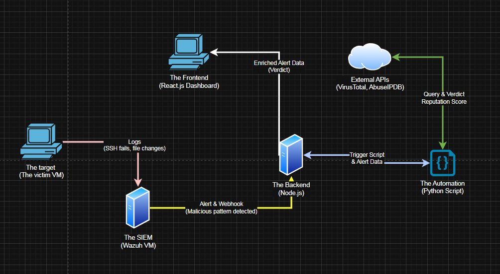
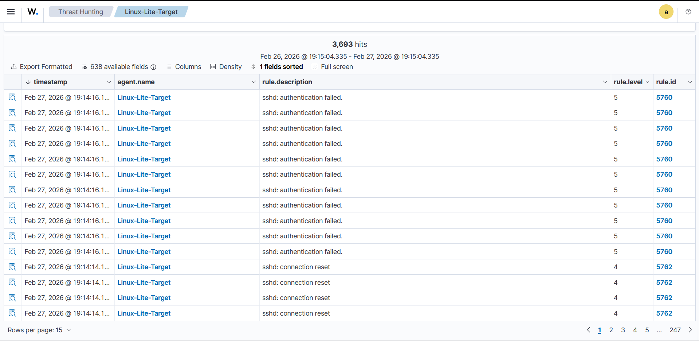

<div align="center">

```
███████╗ █████╗ ██╗██╗  ██╗ ██████╗ ███████╗
╚══███╔╝██╔══██╗██║██║ ██╔╝██╔═══██╗██╔════╝
  ███╔╝ ███████║██║█████╔╝ ██║   ██║███████╗
 ███╔╝  ██╔══██║██║██╔═██╗ ██║   ██║╚════██║
███████╗██║  ██║██║██║  ██╗╚██████╔╝███████║
╚══════╝╚═╝  ╚═╝╚═╝╚═╝  ╚═╝ ╚═════╝ ╚══════╝
```

### Advanced SIEM + SOAR Automated Defense Pipeline

*Detect. Enrich. Block. Stream. — In under 2 seconds.*

[](https://nodejs.org)
[](https://python.org)
[](https://react.dev)
[](https://wazuh.com)
[](https://virustotal.com)
[](https://abuseipdb.com)
[](LICENSE)

</div>

---


## Dashboard Preview



---

## Architecture




---

## Key Features

| Feature | Description |
|---|---|
| 🔍 **Real-Time Log Ingestion** | Wazuh agent monitors `/var/log/auth.log` and Apache logs for brute-force and injection attempts |
| 🌐 **Dual Threat Intelligence** | Cross-references every attacker IP against **VirusTotal** (93+ vendors) and **AbuseIPDB** simultaneously |
| ⚡ **Automated Firewall Response** | SSH's into the victim machine via Paramiko and executes `ufw deny` rules automatically |
| 🔁 **Fault-Tolerant Webhooks** | Exponential backoff on API rate limits (HTTP 429), retry logic, and structured JSON logging |
| 📡 **Live WebSocket Streaming** | Node.js pushes threat verdicts to the dashboard in real-time via Socket.io |
| 🖥️ **Cyberpunk SOC Dashboard** | React frontend with animated terminal output, live threat timeline, and system health monitoring |
| 🛡️ **History Replay** | Dashboard reconnects and restores the last 50 alerts instantly — no data loss on refresh |

---

## Technology Stack

```
SIEM / Detection          Wazuh Manager + Agent
Threat Intelligence       VirusTotal API  •  AbuseIPDB API
Automated Response        Python 3  •  Paramiko SSHv2  •  Linux UFW
Backend / Orchestration   Node.js  •  Express.js  •  Socket.io
Frontend / Visibility     React.js (Vite)  •  CSS3 (CRT effects)
Transport                 HTTP Webhooks  •  WebSocket (bidirectional)
```

---

## Pipeline Walkthrough

### Stage 1 — Detection
The **Target VM** runs a custom SSH server and Apache web server as the attack surface. The Wazuh agent watches auth logs in real time and fires on brute-force patterns.

### Stage 2 — Alert Forwarding
When Wazuh detects a **Level 10+** event, the custom `custom-soar` integration script POSTs the full JSON alert payload to the Node.js backend.

```xml
<!-- ossec.conf — add this inside <ossec_config> -->
<integration>
  <name>custom-soar</name>
  <hook_url>http://<BACKEND_IP>:3000/wazuh-alert</hook_url>
  <level>10</level>
  <alert_format>json</alert_format>
</integration>
```

### Stage 3 — Threat Analysis
`analyzer.py` immediately queries both APIs in sequence and computes a risk verdict:

| Verdict | Condition |
|---|---|
| 🔴 **CRITICAL RISK** | VT malicious vendors ≥ 1 **AND** AbuseIPDB confidence ≥ 25% |
| 🟠 **HIGH RISK** | AbuseIPDB confidence ≥ 25% only |
| 🟡 **MEDIUM RISK** | VT suspicious vendors > 0 |
| 🟢 **CLEAN** | No signals from either source |

### Stage 4 — Automated Block
If verdict is `CRITICAL` or `HIGH`, the engine SSH's into the target machine and runs:

```bash
sudo ufw deny from <ATTACKER_IP> to any
sudo ufw deny out to <ATTACKER_IP>
```

Duplicate-rule detection prevents the same IP from being blocked twice.

### Stage 5 — Live Dashboard
The entire process — API queries, verdict, firewall action — is streamed live to the React dashboard over Socket.io. Analysts see everything as it happens.



---

## Installation & Deployment

### Prerequisites

- Wazuh Manager instance (VM or bare metal)
- Target Linux VM with Wazuh Agent + UFW enabled
- Node.js v18+ and Python 3.8+
- API keys for [VirusTotal](https://www.virustotal.com/gui/join-us) and [AbuseIPDB](https://www.abuseipdb.com/register)

---

### Step 1 — Deploy the Wazuh Integration

```bash
# Copy the forwarder script
sudo cp wazuh-integration/custom-soar /var/ossec/integrations/custom-soar

# Set correct permissions (Wazuh requires this)
sudo chmod 750 /var/ossec/integrations/custom-soar
sudo chown root:wazuh /var/ossec/integrations/custom-soar

# Add the integration block to ossec.conf, then restart
sudo systemctl restart wazuh-manager
```

---

### Step 2 — Configure Environment Variables

Create a `.env` file in the project root:

```ini
VT_API_KEY=your_virustotal_api_key_here
ABUSE_API_KEY=your_abuseipdb_api_key_here

TARGET_HOST=192.168.x.x
TARGET_PORT=22
TARGET_USER=your_ssh_user
TARGET_PASS=your_ssh_password
```

> ⚠️ **Security Note:** For production, replace password auth with SSH key authentication. Never commit `.env` to version control — it's already in `.gitignore`.

---

### Step 3 — Start the Backend

```bash
# Clone the repo
git clone https://github.com/ZaikOSS/ZaikOS-SIEM-SOAR.git
cd ZaikOS-SIEM-SOAR

# Install Node.js dependencies
npm install

# Install Python dependencies
pip install requests paramiko

# Launch the SOAR engine
node app.js
```

The backend exposes:
- `POST /wazuh-alert` — Wazuh webhook receiver
- `GET  /health` — System status + uptime
- `GET  /api/alerts` — Last 100 alerts (JSON)
- `WS   socket.io` — Live dashboard feed

---

### Step 4 — Launch the Dashboard

```bash
cd soc-dashboard
npm install
npm run dev
```

Open `http://localhost:5173` — the dashboard connects automatically via Socket.io.

---

## Project Structure

```
ZaikOS-SIEM-SOAR/
│
├── app.js                    # Node.js backend + Socket.io server
├── analyzer.py               # Python threat intelligence engine
├── package.json
├── .env                      # API keys & SSH config (not committed)
│
├── wazuh-integration/
│   └── custom-soar           # Wazuh forwarder script (Python)
│
└── soc-dashboard/            # React + Vite frontend
    ├── src/
    │   └── App.jsx           # Main dashboard component
    └── package.json
```

---

## How the Lab is Wired

```
┌─────────────────────────────────────┐
│         Host Machine (Windows)      │
│                                     │
│   ┌─────────────┐  ┌─────────────┐  │
│   │  Node.js    │  │  React      │  │
│   │  :3000      │  │  :5173      │  │
│   └─────────────┘  └─────────────┘  │
└──────────────┬──────────────────────┘
               │  Host-Only Network (192.168.100.x)
    ┌──────────┴───────────┐
    │                      │
┌───┴────────┐      ┌──────┴──────┐
│ Wazuh VM   │      │  Target VM  │
│ :1514/1515 │      │  SSH :22    │
│ Manager    │      │  UFW armed  │
└────────────┘      └─────────────┘
         ▲
         │ attacks
    [ Kali / Attacker VM ]
```

---

## Contact

<div align="center">

**Zakaria Ouadifi**

[](mailto:zakaria.ouadifi@usmba.ac.ma)
[](https://www.linkedin.com/in/zakaria-ouadifi/)

*If you found this project useful or interesting, a ⭐ on the repo goes a long way.*

</div>

---

<div align="center">
<sub>Built with paranoia and too much caffeine. // ZaikOS v2.0</sub>
</div>
